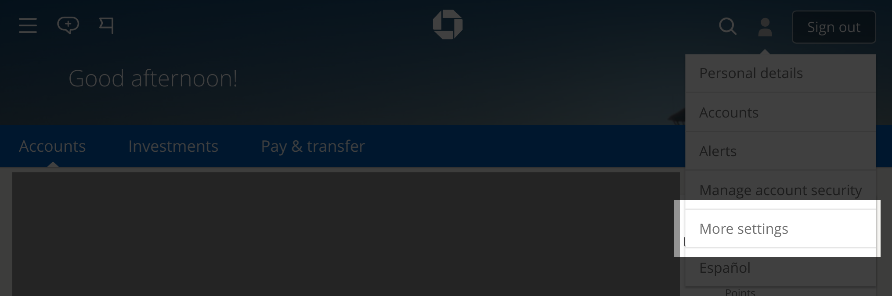
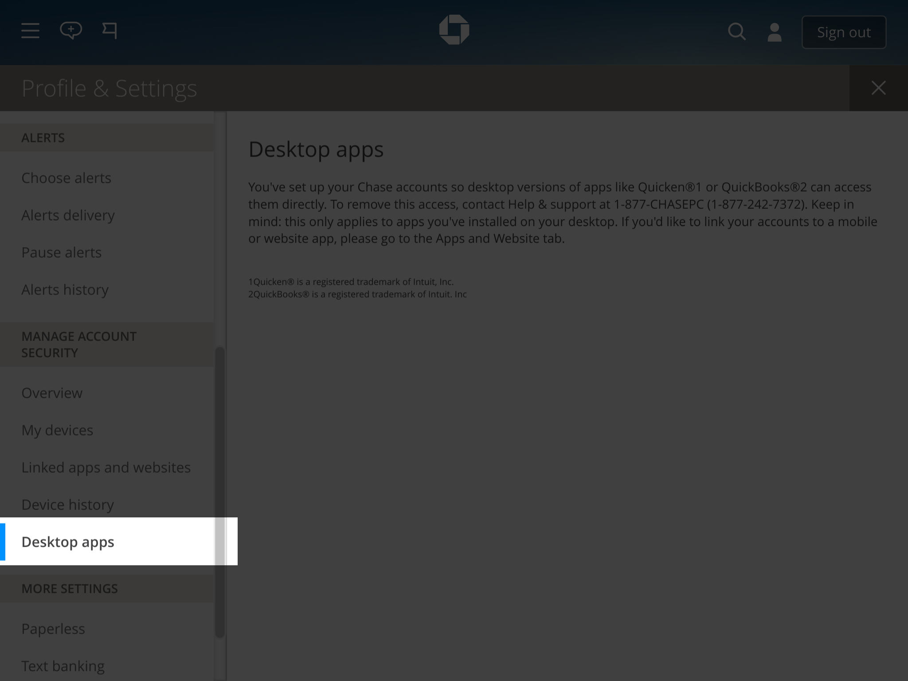
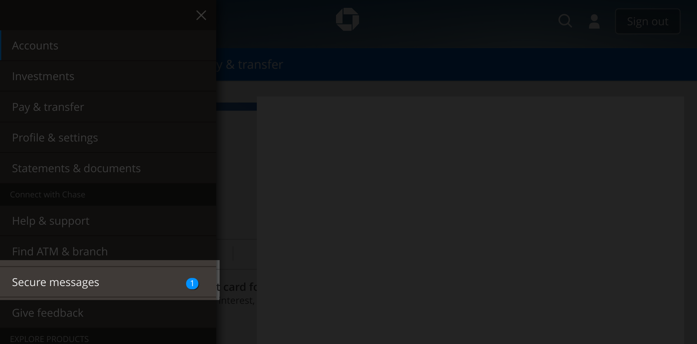

You must enable access. You can do this by logging on to chase.com, opening
your Profile & Settings:




And going to the 'Desktop Apps' section:



Once enabled, you will need to authorize this client. First, you must attempt
a login, either by trying to list accounts or some other remote operation. You
will receive the following error message:

```
Please verify your identity within the next 7 days. Using your desktop
computer, go to your banks website and visit the Secure Message Center for
instructions.

```

Now you can enable access for your application. Go to the 'Secure Message
Center':




To find the authorization link.
